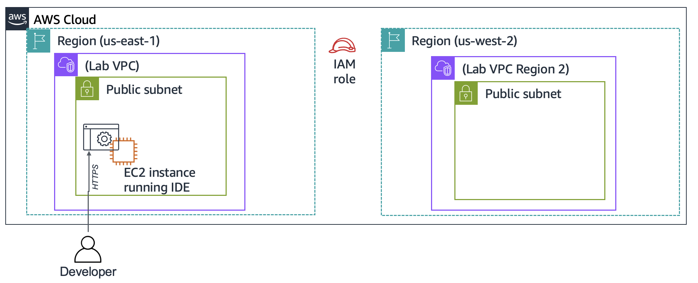

# Challenge Lab: Creating a Dynamic Website for the Café (End‑to‑End Build Notes)

I completed AWS’s “Challenge Lab: Creating a Dynamic Website for the Café,” taking an S3‑hosted static site to a fully dynamic, PHP/MySQL application on Amazon EC2 with secrets managed by AWS Secrets Manager. I also created an AMI and deployed a production clone of the app in a second AWS Region.

This README documents everything I did, why I did it, and how you can reproduce the build. It includes places to drop screenshots and a link to my demo video.

- Author: @Siddharthh39
- Duration: ~60 minutes
- Tech: Amazon EC2, Amazon Linux, Apache (httpd), PHP, MariaDB (MySQL), AWS Secrets Manager, IAM, AMIs, VPC/Security Groups

---

## Table of Contents

1. What I built
2. Architecture
3. Prerequisites
4. Step‑by‑step implementation
   - 4.1 Connect to the IDE
   - 4.2 Prepare the LAMP stack and expose the web server
   - 4.3 Install the café application
   - 4.4 Configure Secrets Manager and the database
   - 4.5 Fixing the “/cafe” page (root cause + resolution)
   - 4.6 Test the app (orders and history)
   - 4.7 Create an AMI and deploy to a second Region
5. Validation checklist
6. Troubleshooting notes
7. What I learned
8. Repo usage and how to add media
9. Cleanup
10. References

---

## 1) What I built

- A development EC2 instance in us‑east‑1 running:
  - Apache httpd on port 8000
  - PHP with correct timezone settings
  - MariaDB 10.5 with a “cafe_db” schema and seed data
  - AWS SDK for PHP (v3) to read configuration from Secrets Manager
- A production clone in us‑west‑2 launched from a custom AMI, with the same Secrets Manager parameters recreated in the new Region.
- End‑to‑end demo: place orders from the Menu page and view them in Order History.

Demo video: [

https://github.com/user-attachments/assets/dfc7fd38-d9ac-4a2c-b7a5-a02a0763e5a6

]

---

## 2) Architecture

High‑level:

- Development (us‑east‑1): EC2 + IDE (code‑server), Secrets Manager
- Production (us‑west‑2): EC2 launched from AMI, Secrets Manager (same parameters recreated in this Region)
- Security Groups allow TCP 22 (SSH) and 8000 (HTTP) inbound

Screenshots (drop your files into docs/images and update the paths):
- Initial resources (IDE instance only)  
   <!-- Replace with Image 4 -->
- Final two‑Region deployment  
   <!-- Replace with Image 3 -->
- Secrets script edits (Region + public DNS)  
   <!-- Replace with Image 2 -->
- MariaDB console session  
   <!-- Replace with Image 1 -->

---

## 3) Prerequisites

- Lab‑provided AWS account with pre‑created “Lab IDE” EC2 instance
- Access to AWS Console and the code‑server (VS Code in browser)
- IAM role “CafeRole” available (allows reading Secrets Manager parameters)

Networking notes:
- Open inbound TCP 8000 to reach Apache (IDE uses port 80)
- Open inbound TCP 22 for SSH (optional, useful for debug)
- Default outbound allowed for the instance to reach AWS APIs (Secrets Manager)

---

## 4) Step‑by‑step implementation

### 4.1 Connect to the IDE

- From the lab page, copy LabIDEURL and LabIDEPassword.
- Open LabIDEURL in a new tab, enter LabIDEPassword, and log in to code‑server (VS Code in browser).
- Confirm the workspace shows `/home/ec2-user/environment` and an integrated bash terminal.

### 4.2 Prepare the LAMP stack and expose the web server

Identify OS:
```bash
cat /proc/version
```

Install/enable Apache on port 8000 and confirm PHP:
```bash
sudo sed -i 's/Listen 80/Listen 8000/g' /etc/httpd/conf/httpd.conf
sudo systemctl start httpd
sudo systemctl enable httpd
sudo service httpd status
php --version
```

Install and enable MariaDB (MySQL):
```bash
sudo dnf install -y mariadb105-server
sudo systemctl start mariadb
sudo systemctl enable mariadb
sudo mariadb --version
sudo service mariadb status
# If the status pager holds the terminal, press Q to return to the prompt.
```

Work comfortably from the IDE by linking the web root and fixing ownership:
```bash
ln -s /var/www/ /home/ec2-user/environment
sudo chown ec2-user:ec2-user /var/www/html
```

Quick smoke test page:
- Create `/var/www/html/index.html` with:
```html
<html>Hello from the café web server!</html>
```

Open the instance Security Group and add inbound rules:
- TCP 8000 from 0.0.0.0/0 (required to reach Apache on 8000)
- TCP 22 from 0.0.0.0/0 (optional for SSH debugging)

Browse to:
```
http://<public-ip>:8000/
```
You should see “Hello from the café web server!”.

### 4.3 Install the café application

From the IDE terminal:
```bash
cd ~/environment
wget https://aws-tc-largeobjects.s3.us-west-2.amazonaws.com/CUR-TF-200-ACACAD-3-113230/03-lab-mod5-challenge-EC2/s3/setup.zip
unzip setup.zip
wget https://aws-tc-largeobjects.s3.us-west-2.amazonaws.com/CUR-TF-200-ACACAD-3-113230/03-lab-mod5-challenge-EC2/s3/db.zip
unzip db.zip
wget https://aws-tc-largeobjects.s3.us-west-2.amazonaws.com/CUR-TF-200-ACACAD-3-113230/03-lab-mod5-challenge-EC2/s3/cafe.zip
unzip cafe.zip -d /var/www/html/
cd /var/www/html/cafe/
wget https://docs.aws.amazon.com/aws-sdk-php/v3/download/aws.zip
wget https://docs.aws.amazon.com/aws-sdk-php/v3/download/aws.phar
unzip aws -d /var/www/html/cafe/
chmod -R +r /var/www/html/cafe/
```

Set PHP timezone and restart Apache:
```bash
sudo sed -i '2i date.timezone = "America/New_York" ' /etc/php.ini
sudo service httpd restart
```

### 4.4 Configure Secrets Manager and the database

Create Secrets Manager parameters via the provided script:
```bash
cd ~/environment/setup/
./set-app-parameters.sh
```

Verify the seven secrets exist (Console > Secrets Manager > Secrets). Copy the value of `/cafe/dbPassword` for the next step.

Initialize DB schema and seed data:
```bash
cd ~/environment/db/
./set-root-password.sh
./create-db.sh
```

Connect to MariaDB as the application admin:
```bash
mysql -u admin -p
# Paste the /cafe/dbPassword value
```

Sanity checks in MySQL:
```sql
show databases;
use cafe_db;
show tables;
select * from product;
exit;
```

### 4.5 Fixing the “/cafe” page (root cause + resolution)

Symptom: `http://<public-ip>:8000/cafe` rendered partially or failed.

Root cause in my run: The PHP app retrieves configuration from AWS Secrets Manager via the AWS SDK. Without an appropriate instance profile, the SDK cannot read the secrets, causing the page to fail when it tries to build DB connection parameters.

Resolution:
- Attach IAM instance profile “CafeRole” to the EC2 instance (Console > EC2 > Instances > Actions > Security > Modify IAM role).
- Ensure outbound internet access is allowed (default SG outbound “All traffic” is fine).
- Confirm the Region used by the script matches the instance Region.

After attaching the role, refresh `/cafe` and the menu loads successfully.

Additional verifications:
- Security Group inbound includes TCP 8000
- Apache is running, PHP timezone set, and file permissions under `/var/www/html` allow reads by `apache`

### 4.6 Test the app (orders and history)

- Go to `http://<public-ip>:8000/cafe`
- Open the Menu page
- Add at least one item and click “Submit Order”
- Place another order
- Open “Order History” and verify both orders appear

### 4.7 Create an AMI and deploy to a second Region

Prepare the instance and a key:
```bash
sudo hostname cafeserver
ssh-keygen -t rsa -f ~/.ssh/id_rsa   # Press Enter for empty passphrases
cat ~/.ssh/id_rsa.pub >> ~/.ssh/authorized_keys
```

Create the AMI:
- EC2 > Instances > Select the dev instance
- Actions > Images and templates > Create image
- Image name: `CafeServer`
- Create and wait until AMI status = Available

Launch in Oregon (us‑west‑2):
- Switch Console Region to us‑west‑2
- AMIs > Owned by me > select `CafeServer` AMI > Launch
- Name tag: `ProdCafeServer`
- Instance type: `t2.small`
- Key pair: Proceed without a key pair (I can still SSH with the baked key)
- Network settings:
  - VPC: `Lab VPC Region 2`
  - Subnet: `Public Subnet`
  - Security group: `cafeSG` with inbound TCP 22 and 8000 open to 0.0.0.0/0
- Advanced details > IAM instance profile: `CafeRole`
- Launch, wait for Public IPv4 DNS to appear, copy it

Recreate Secrets in us‑west‑2:
- Edit `~/environment/setup/set-app-parameters.sh`
  - Set `region='us-west-2'`
  - Set `publicDNS='<the ProdCafeServer Public IPv4 DNS>'` (keep the quotes, remove angle brackets)
- Save and run:
```bash
cd ~/environment/setup/
./set-app-parameters.sh
```

Validate production:
- `http://<prod-public-ip>:8000/` shows “Hello from the café web server!”
- `http://<prod-public-ip>:8000/cafe` shows the full site
- Place an order and confirm in “Order History”

Optional SSH to prod for debug:
```bash
ssh -i ~/.ssh/id_rsa ec2-user@<prod-public-ip>
```

---

## 5) Validation checklist

- [ ] Apache runs on port 8000 and serves `/index.html`
- [ ] PHP timezone configured and httpd restarted
- [ ] MariaDB running; `cafe_db` exists; `product` table populated
- [ ] AWS SDK for PHP present; Secrets created in Region
- [ ] Instance has IAM role `CafeRole`
- [ ] `/cafe` loads menu; orders can be submitted and viewed
- [ ] AMI `CafeServer` created from dev
- [ ] Production instance launched in us‑west‑2 with `CafeRole` and correct SG
- [ ] Secrets recreated in us‑west‑2 with `publicDNS` of prod
- [ ] Prod `/cafe` fully functional

---

## 6) Troubleshooting notes

- 8000 unreachable: Add inbound SG rule on TCP 8000 from 0.0.0.0/0.
- `/cafe` blank/partial: Attach `CafeRole` IAM instance profile so PHP can read Secrets Manager.
- Secrets not found errors: Ensure `AWS_DEFAULT_REGION`/script Region matches the instance Region; rerun `set-app-parameters.sh`.
- DB connection errors: Re‑check `/cafe/dbPassword`, run `./set-root-password.sh` and `./create-db.sh`, and ensure MariaDB is running.
- Time skew or date issues: Ensure PHP timezone is set and `httpd` restarted.

---

## 7) What I learned

- Why to externalize sensitive config (DB creds, endpoints) to Secrets Manager and access them via IAM roles rather than hard‑coding.
- How to configure Apache/PHP on Amazon Linux and run on a non‑standard port alongside code‑server.
- How to seed a MariaDB schema for a PHP app and verify connectivity.
- How AMIs capture instance state for fast, consistent cross‑Region deployment.
- The importance of separating dev and prod in different Regions for resilience and safer iteration.

---

## 8) Repo usage and how to add media

Recommended structure:
```
.
├─ docs/
│    ├─ architecture-start.png     
│    ├─ architecture-final.png     
│    ├─ set-app-parameters.png     
│    └─ mariadb-console.png        
└─ README.md
```

- Replace the image placeholders in this README with your actual file names in `docs/images/`.
- Add your demo video link at the top (YouTube, Loom, etc.).

---

## 9) Cleanup

- If this is a personal AWS account, terminate both EC2 instances and delete associated EBS volumes, Security Groups, and the AMIs to avoid ongoing costs.
- Optionally delete the Secrets in both Regions.

---

## 10) References

- [AWS EC2](https://docs.aws.amazon.com/ec2/)
- [AWS Secrets Manager](https://docs.aws.amazon.com/secretsmanager/)
- [AWS SDK for PHP v3](https://docs.aws.amazon.com/sdk-for-php/v3/developer-guide/welcome.html)
- [MariaDB](https://mariadb.org/) / [MySQL Client Docs](https://dev.mysql.com/doc/refman/8.0/en/mysql.html)

---
